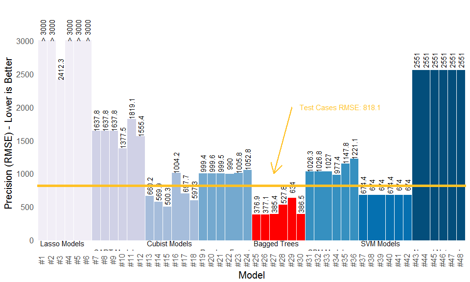

Bus Ridership Prediction for Predictive Analytics Capstone
----------------------------------------------------------

Intro text

### R syntax files I used to generate the material necessary for the repo:

------------------------------------------------------------------------

-   [01 - Data Integration & Missing Imputation
    Codeup.R](https://github.com/msheffer2/Bus-Ridership-Prediction/blob/master/01%20-%20Data%20Integration%20%26%20Missing%20Imputation.R)
    -- Original data codeup spanned several data files and syntax files
    that were used to coordinate the codeup across different individuals
    and different data collection efforts. This file begins with the
    completed "coded data" and uses it to integrate into a single
    dataset usable for prediction..
-   [02 - EDA & Model
    Prep.R](https://github.com/msheffer2/Bus-Ridership-Prediction/blob/master/02%20-%20EDA%20%26%20Model%20Prep.R)
    -- This syntax cycles through each of the predictors and creates
    graphs of its distrubtion with ridership. The purpose of this was
    not only to perform EDA but to also examine if data transformations
    might not be helpful. The data is then prepped for analysis by
    checking for Zero Variance variables and highly correlated
    predictors, as well as by creating training and testing
    partitions needed.
-   [03 - Model
    25.R](https://github.com/msheffer2/Bus-Ridership-Prediction/blob/master/03%20-%20Model%2025.R)
    -- Generates the original winning model out of the 48 competing
    models: bagged trees based on untransformed data.
-   [04 - Plotting
    Data.R](https://github.com/msheffer2/Bus-Ridership-Prediction/blob/master/04%20-%20Plotting%20Data.R)
    -- This is only an excerpt from the original file that plots
    presicion estimates for the competiting models.
-   [05 - Improving Model
    25.R](https://github.com/msheffer2/Bus-Ridership-Prediction/blob/master/05%20-%20Improving%20Model%2025.R)
    -- This syntax file revises Model \#25 to see if its possible to
    improve on current predictions but with fewer predictors. Revised
    \#25 uses just 12 predictors to beat out the current model but with
    far more manageable predictors for use later.
-   [06 - Post Revision
    Plots.R](https://github.com/msheffer2/Bus-Ridership-Prediction/blob/master/06%20-%20Post%20Revision%20Plots.R)
    -- Comparing the case RMSE for Model \#25 to the original method and
    revised \#25. Also plots the variable importances for the
    revised model.
-   [fit\_assess.R](https://github.com/msheffer2/Bus-Ridership-Prediction/blob/master/fit_assess.R)
    -- a wrapper function to calculate the peformance metrics required
    to compare the models. It calculates prediction accuraces via RMSE
    for training, testing, and test case data sets.

#### Technical Notes:

-   The work shown here is less "replicable" than some of the other
    repos because of the need to alter all the original data and to
    avoid showing lots of rather uninteresting syntax showing multiple
    modelling efforts. Instead, I provide pre-cleaned or pre-outputted
    data to streamline this process. The random forest predictions show
    here, though, should be completely reproducible.

### Analytical Highlights

------------------------------------------------------------------------

x

##### Figure 1: Comparing the predictive accuracy of the 48 models tested

x

#### Model Function for Random Forest

------------------------------------------------------------------------

x

##### Figure 2: Model \#25, Revised Model \#25, & Historical Prediction Precision

x

##### Figure 3: Model \#25 Revised Model Importance

    ## Loading required package: randomForest

    ## randomForest 4.6-12

    ## Type rfNews() to see new features/changes/bug fixes.

    ## 
    ## Attaching package: 'randomForest'

    ## The following object is masked from 'package:ggplot2':
    ## 
    ##     margin

    ## The following object is masked from 'package:dplyr':
    ## 
    ##     combine

x

The last task, then, is to score the database so that the client can use
the predictions to plan promotional or sales pieces targetted toward
each segment. The "positive" sample bias noted above is even more
obvious now once the estimated population sizes are shown in Table 2.
Segment 4 was a critical group and represented about 13% of the sample
but in reality, this group of individuals likely represents closer to 3%
of the target universe for the client (as an aside, this low percentage
was not a surprise to the client). Similarly, Segment 5 represent the
lowest opportunity for the client; it was only about 22% of the sample
but turned out to be a disappointing 41% of the target universe.

------------------------------------------------------------------------

##### References Cited

1.  Kuhh, Max. and Kjell Johnson. 2013. Applied Predictive Modelling.
    New York: Springer.
2.  Kohavi, Ron. 1995. "A Study of Cross-Validation and Bootstraop for
    Accuracy Estimation and Model Selection". Presented at the
    International joint Conference on Artificial Intelligence,
    Montreal, Quebec.
3.  Borra, Simone. and Agostino Di Ciaccio. 2010. "Measuring the
    Prediction Error: A Comparison of Cross-Validation, Bootstrop, and
    Covariance Penalyt Methods". Computational Statistics and
    Data Analysis. 54: 2976-2989.
